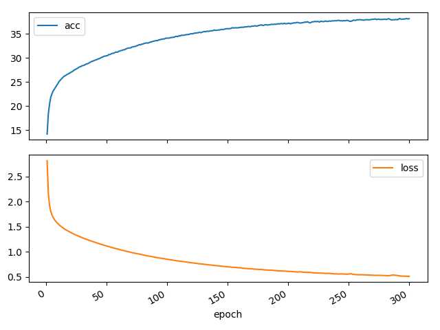

# Dinosaur name generator

This repository implements simple character level language model using many-to-many recurrent neural net
to generate novel dinosaur names.

## How it works

Idea is to train the RNN to predict the next letter of the dinosaur name given the previous one, so for example given
the name `brontosaurus` if we pass the first letter `b` we expect the RNN to predict the `r` as a next letter then given
`r` we expect the `o` and so on. By doing so RNN learns the probability distribution of each letter in the alphabet
given the previous sequence of letters.    

For generating new names first we input the random letter from alphabet and pass it through the RNN. We get
the probability distribution of the next letter that we sample from and pass it as the next input of the RNN.
We continue until we sample the end of string(`<EOS>`) character

The input of the RNN is one hot encoded letters. The output is the probability vector.

## How to run

First make sure to install all dependencies specified in `requirements.txt`. Then run:  
`python train.py`

## Results



```
Epoch 10
amosauru<EOS>
hymlosaurus<EOS>
chzhadronsaurawrotelus<EOS>
ongbelus<EOS>
yonoratesis<EOS>
teoptor<EOS>
pelorasaurus<EOS>
clrosaurus<EOS>
lomemilgi<EOS>
inontyannus<EOS>

Epoch 150
tiacnisaurus<EOS>
eishadai<EOS>
apolacpeuosaurus<EOS>
iolorsaus<EOS>
uillophosaurus<EOS>
urotianisteos<EOS>
anshengosuchus<EOS>
udinysus<EOS>
ukuisaurus<EOS>
egnapasaurus<EOS>

Epoch 300
vacantisaurus<EOS>
iupalong<EOS>
tahraptor<EOS>
ubelangulinga<EOS>
ayandellinachus<EOS>
ectodon<EOS>
iolugykosaurus<EOS>
iarcaratops<EOS>
uszholia<EOS>
anjiannisaurus<EOS>
```

## References

1. [deeplearning.ai](https://www.coursera.org/learn/nlp-sequence-models)